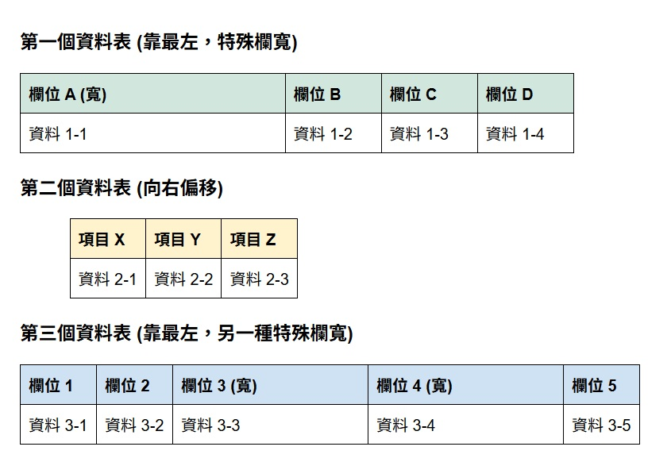

# 專案名稱
Reporting Service 對齊大師
這是我利用 Claude 協助開發的 SSRS 排版自動化工具。
這是我第一次使用github，很開心

### 介面與結構示意圖

## 問題
因為SSRS很容易因為對齊問題而有空白欄位，xml和UI都非常難讀。
另外還有分頁問題待之後有機會時一起解決

## 開發流程說明
1.  由我負責規劃報表結構與欄位驗證。
2.  利用 Claude 生成 RDL/SSRS 相關的佈局與格式邏輯。
3.  確保上下沒對齊時可以立刻發現，或是跑版時也可以及早發現

## 更新時機
等待下次又遇到另一個對齊崩潰的時機

## 未來展望
我會再放更多自動化工具或SSRS技巧介紹
